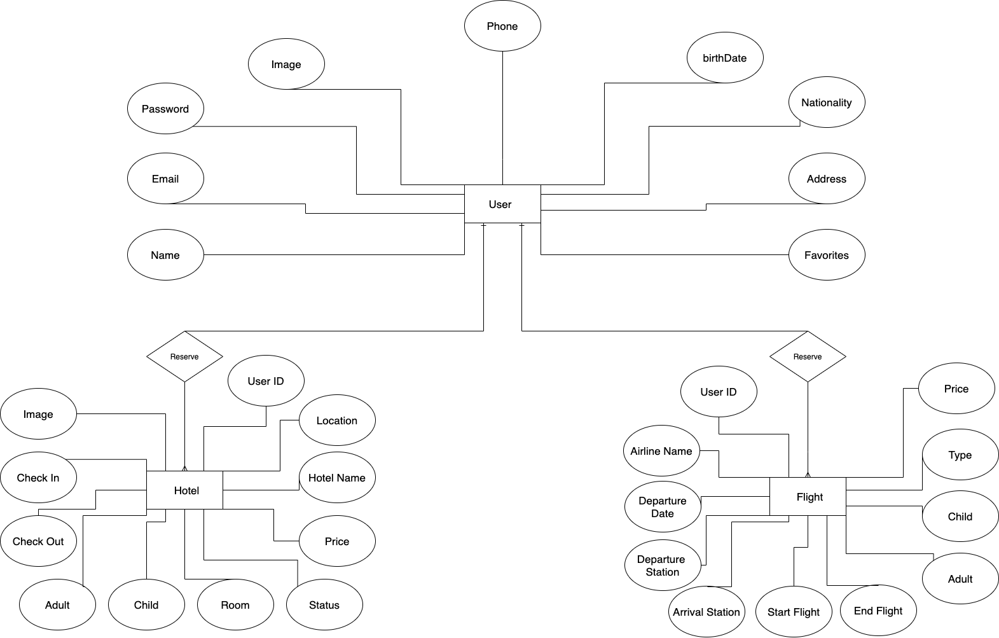

# Look-Around-Back-end

## What Look Around Does
Whether you are planning a family vacation, traveling with your friends or going on a business trip inside or outside the Kingdom, Look Around is your gateway to book your trip in just minutes.

## Look Around Front-end Repository
[Look Around Front-end](https://git.generalassemb.ly/abdullahfaden/Look-Around-Front-end)


## Proplem Solving Strategy 
for solving problems that may occur:
- First, identify the problem and its location to avoid causing other problems.
- Analyze the problem and verify sayntx.
- Apply the expected solutions.

## ERD



## Used Technologies
* Express/NodeJS
* MongoDB
* BcryptJS
* Cors
* Dotenv
* JSON Web Tokens

## Catalog of Routes

### User Routes
|     Method    | URI Pattern       | Description  |
| ------------- | -------------     |-------------|   
| POST          | user/register     |sign up user |
| POST          | user/login        |login user |
| PUT           | user/update/:id   |update user information|
| DELETE        | user/delete/:id   |Delete user account|
|resetpassword  | user/resetpassword/:resetLink|for forget password|
|forgotpassword | user/forgotpassword|for Changed password|
|allflights | user/allflights/:userID|get all user flights|
|allflights | user/allhotels/:userID|get all user hotels|


### Hotel Routes
|     Method    | URI Pattern                  |Description  |
| ------------- | -------------                |-------------|   
| POST          | hotel/add/:user_id_          | add hotel booked by user |
| PUT           | hotel/update/:hotel_id       | update hotel Reservation |
| PUT           | hotel/changestatus/:hotel_id |for cancel Reservation|
| get           | hotel/show/:hotel_id |show one Reservation |


### Flights Routes
|     Method    | URI Pattern                  |Description  |
| ------------- | -------------                |-------------|   
| POST          | Flight/add/:user_id_          | add Flight booked by user |
| PUT           | Flight/update/:hotel_id       | update Flight Reservation |
| PUT           | Flight/changestatus/:hotel_id |for cancel Reservation|
| get           | Flight/show/:hotel_id |show one Reservation |

## Installation Instructions
```html
npm i // to install all the packages
